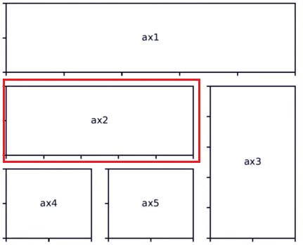
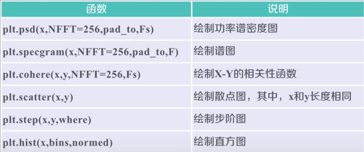
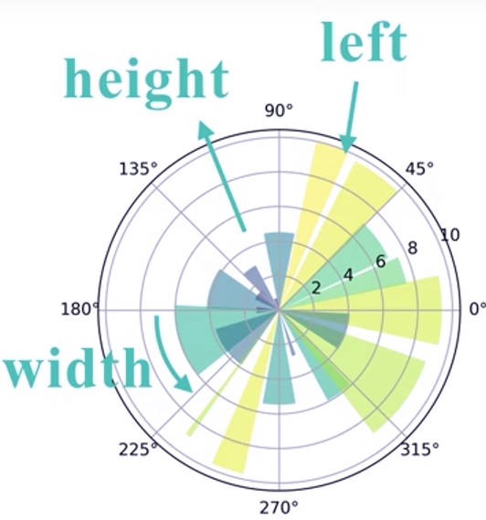

# Matplotlib_intro

## 1.图像的操作 PIL

`PIL,Python Image Library`，PIL 是一个具有强大图像处理能力的第三方库。

安装命令：`pip install pillow`

### 1.1 图像操作的一般流程

```python
# Image 代表图像的一个类
from PIL import Image
# 图像边数组
im = np.array(Image.open("img/01.jpg"))
# 数组操作，计算 RGB 的补值
cm = [255, 255, 255] - im
# 数组变为图像
im = Image.fromarray(cm.astype('uint8'))
im.save("img/02.jpg")
```

### 1.2 图像的手绘

特点：

- 黑白灰色
- 边界线条重
- 相同或相近色彩趋于白色


```python
a = np.array(Image.open('img/01.jpg').convert('L')).astype('float')
depth = 10.  # (0-100)
grad = np.gradient(a)  #图像灰度的梯度值
grad_x, grad_y = grad
grad_x = grad_x * depth / 100
grad_y = grad_y * depth / 100
A = np.sqrt(grad_x**2 + grad_y**2 + 1.)
uni_x = grad_x / A
uni_y = grad_y / A
uni_z = 1. / A

vec_el = np.pi / 2  #光源的俯视角度，弧度值
vec_az = np.pi / 4
# 光源对 x,y,z 轴的影响
dx = np.cos(vec_el) * np.cos(vec_az)
dy = np.cos(vec_el) * np.sin(vec_az)
dz = np.sin(vec_el)

# 光源归一化
b = 255 * (dx*uni_x + dy*uni_y + dz*uni_z)
b = b.clip(0, 255)

im = Image.fromarray(b.astype('uint8'))
im.save('img/001.jpg')
```


## 2.matplotlib

官方 API：https://matplotlib.org/3.5.3/api/index.html

Matplotlib 库由各种可视化类构成，一般通过 **`matplotlib.pyplot` 绘制各类可视化图形的命令子库，相当于一种快捷方式。**

```python
import matplotlib.pyplot as plt
# 输入的为一维数组，默认是 y, x的值则是对应的索引
plt.plot([100,200,300,400])
plt.ylabel("example")
#dpi 每英寸空间中包含的像素点个数，默认保存的为 png 格式
plt.savefig('im_name', dpi=600)
plt.show()
```

- `plt.axis([x_min, x_max, y_min, y_max])`：设置坐标轴的尺度
- `plt.sunplot(行，列，所处位置序号)`：如 `plt.subplot(3, 2, 4)` 或 **`plt.subplot(324)`**

### 2.1 plot

`plot(x, y, format_string, **kwargs)`

- `format_string`：指定的格式。包括：颜色字符，风格字符，标记字符
- 使用其他形式：
  - `color `-- 控制颜色
  - `linestyle` -- 线条风格
  - `marker` -- 标记风格
  - `markerfacecolor` -- 标记颜色
  - `markersize` -- 标记尺寸
  - ...


```python
plt.plot(x1, y1, 'go-', x2, y2, 'rx', x3, y4, 'b-.')
plt.show()
```


### 2.2 中文显示

**1.使用 rcParams 修改全局字体实现**

```PYTHON
import matplotlib.pyplot as plt
import matplotlib as mpl
# 使用黑体
mpl.rcParams['font.family']='SimHei'
```

- `font.family`：字体的名字
- `font.style`：斜体 `italic`; 正常 `normal`
- `font.size`：字体大小，`large`，`x-samll` 等


```python
rc('lines', linewidth=2, color='r')
# 等价于
rcParams['lines.linewidth'] = 2
rcParams['lines.color'] = 'r
```

**2.增加属性 fontproperties**

建议使用的方式：

```python
plt.xlabel("时间",fontproperties='SimHei', fontsize=20)
```

**文本显示**

- `plt.xlabe()`
- `plt.ylabe()`
- `plt.title()`：标题
- `plt.text()`：任意位置增加文本
- `plt.annotate()`：在图形中增加带箭头的注解


### 2.3 设计子区域

`plt.subplot2grid(划分的网格形式，当前所处的位置，列延伸，行延伸)`，**注意从 0 开始编号**

```python
# 编号从 0 开始
plt.subplot2grid((3,3),(1,0),colspan=2)
```



**使用 GridSpec 类**

进行子区域设计和选择，`GridSpec + subplot == subplot2grid`

```python
import matplotlib.gridspec as gridspec
# 设计网格
gs = gridspec.GridSpec(3, 3)
ax1 = plt.subplot(gs[0, :])
ax2 = plt.subplot(gs[1, :-1])
ax3 = plt.subplot(gs[1:, -1])
ax4 = plt.subplot(gs[2, 0])
ax5 = plt.subplot(gs[2, 1])
```

### 2.4 图表的函数





**极坐标图的绘制**

采用面向对象的方式绘制：



```python
# 极坐标图的绘制
np.random.seed(1)
N = 20 #数据的个数
theta = np.linspace(0.0, 2*np.pi, N, endpoint=False)
# 创造 [0, 1) 的均匀分布
raddi = 10 * np.random.rand(N)
width = np.pi / 4 * np.random.randn(N)

ax = plt.subplot(111, projection='polar')
# 对应 left,height,width
bars = ax.bar(theta, raddi, width=width, bottom=0.0)

# 颜色设置
for r, bar in zip(raddi, bars):
    bar.set_facecolor(plt.cm.viridis(r / 10.))
    bar.set_alpha(0.5)
plt.show()
```


