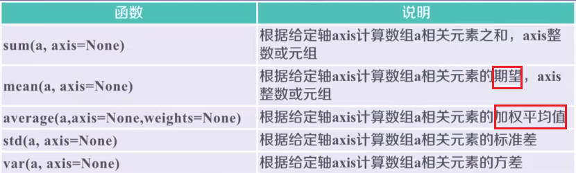

# Numpy_intro

```python
import numpy as np
```

## 1.ndarray

n 维数组对象，numpy 的底层实现由 C 完成，运算性能高效快速。

ndarray 是一个多维数组对象，由两部分组成：

- 实际存储的数据
- 描述这些存储数据的元数据，如维度、类型等

`ndarray` 在程序中的别名为 `array`

```python
np.array([[0,1],[-1,-2]])
```


**属性**

轴 (axis) :保存数据的维度；秩 (rank):轴的数量

- `.ndim`：秩，表示轴的数量或维度的数量
- `.shape`：对象尺度
- `.size`：元素个数
- `.dtype`：元素的类型
- `.itemsize`：**每个元素的大小**

非同质的元素为**对象类型**，`dtype('o')`。


### 1.1 创建

- `np.arange(n)` ：类似于 `range()` 函数，元素从 $0-(n-1)$
- `np.ones(shape),np.zeros(shape)`：全 1，全 0 数组
- **`np.full(shape,val)`**：根据 shape 生成框架，而后由 val 填充
- **`np.eye(n)`**：创建 n×n 的**单位矩阵**

注意的是 `ones,zeros,eye` 生成的默认为**浮点数类型**。`arange()` 生成的默认为整数类型。

**根据其他数组形状生成**：`ones,zeros,full` 都可以，此处以 `ones_like` 为例

- `np.linspace(开始， 结束， 元素个数， endpoint=False)`

  `np.linspace(1, 10 , 4)`：默认为浮点数，范围 [1, 10]，元素个数 4。

  **`endpoint=False` 表示不包含最后一个元素**

- `np.concatenate((a,b))` 将数组连接起来


### 1.2 变换

- `.reshape()`：**不改变原数组**，返回原来数组的拷贝
- `.resize()`：**改变原数组**

- **`new_a=a.astype(new_type)`**：类型转换，**创建一个新的数组**，即使数据类型一致
- `a.tolist()` 将数组转换为列表


### 1.3 索引和切片

**一个维度的切片使用**

- `a[1:2:4]`：**起始编号：终止编号 (不包括)：步长**

多个维度情况下相当于一个维度的组合。

### 1.4 数组的运算

**NP 的一元函数**

**一元函数不改变原来的数组**


**NP 二元函数**


## 2.数据文件的存取

### 2.1 一维、二维数据

**CSV ，Comma-Separated Value**，逗号分隔值，是一种常见的用来批量存储数据的文件格式。

**写入**：`np.savetext：(frame,  array, fmt='%.18e', delimiter=None)`

- frame：文件，可为字符串
- array：待写入的数组
- fmt：文件格式，主要修改的参数，如 %d，%.2f
- delimiter：指定数据间的分割字符串，默认为空格

```python
a = np.arange(100).reshape(5, 20)
np.savetxt('a.csv', a, fmt='%d', delimiter=',')
```

**读取**：`np.loadtxt(frame, dtype=np.float, delimiter=None, unpack=False)`

- unpack=False，将属性分别写入不同的数组变量

**注意的是，由于 CSV 文件的局限性，其只能存储一维、二维数组，savetxt(),loadtxt() 函数也一样**。

### 2.2 多维数据

**写入**：`a.tofile(frame, sep='', format='%s')`

- sep：用于数据分割的字符串，未指定则以二进制形式写入，**但是二进制占用的空间更少**

**读取**：`np.fromfile(frame, dtype=float, count=-1, sep='')`

- count：读入元素的个数。默认 -1 表示读取整个文件
- sep：如果未指定，则按二进制形式读取，即二进制存储，二进制读取。

**注意的是，读取数据时需要知道数据的维度信息，才能最终还原出原来的数组。**

**写入**：`np.save(fname, array)` 或者 `np.savez(fname, array)`

**读取**：`np.load(fname)`

**以 NP 的自定文件存取，自定文件的存储方式为：将元数据(数组的信息)写入第一行，其后为写入的内容**

## 3. NP 的高级函数

### 3.1 随机函数

**`np.random.*` 随机函数子库**

- `rand()`：**浮点数 [0, 1)，均匀分布**
- `randn()`：**标准正态分布**


**高级的随机函数：**

**shuffle(a) 改变数组，permutation() 改变数组。**


### 3.2 统计函数

不输入轴的参数值，即默认情况下对数组的所有元素的计算。



- `argmin(a)`：返回最大值和最小值的**扁平化 (一维) 所处的下标**


### 3.3 梯度函数

**np.gradient(f)：计算数组 f 中元素的梯度，当 f 为多维时，返回每个维度的梯度**

```python
d = np.random.randint(0, 20, (5))
print("原数组为{0}".format(d))
#计算方法
# -3 = (前一个-后一个)/2=(1 - 7) /2
# 最后一个元素：(当前-上一个)/2= (12 - 10)/1
np.gradient(d)
```

对于多维数组，返回 n 个数组，分别代表从第 1 维度到第 n 维度的梯度。

