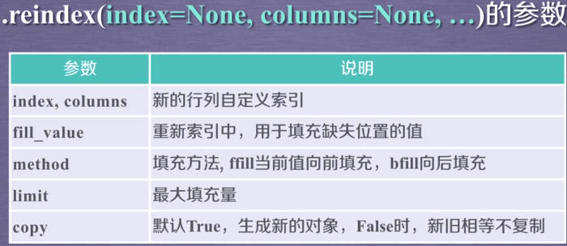
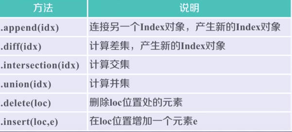
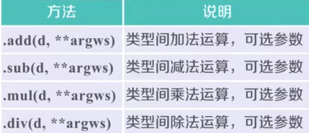
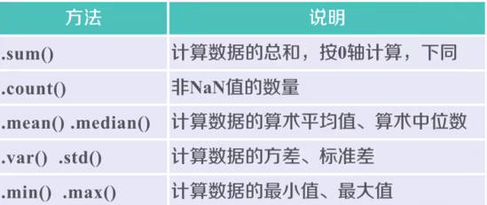
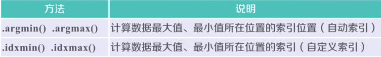
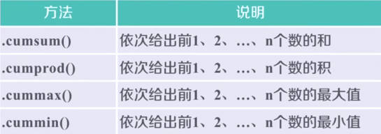
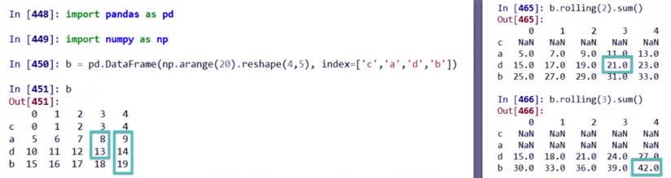
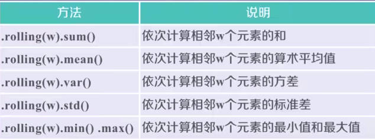

# Pandas_intro

Pandas 官方 API：https://pandas.pydata.org/docs/reference/index.html

数据类型：

- Series：一维数据类型
- DataFrame：多维数据类型

更关注数据的应用表达，数据与索引间的关系。

## 1.数据类型

### 1.1 Series

Series：自定义索引和自动索引并存，索引 + 值 = Series 类型，对 Series类型的切片和运算，全部是生成索引类型，而选择其中的一个值，只会返回数值。

Series 类型会在运算中自动对齐不同索引的数据。Series 对象和索引具有名字属性

```python
b.name = 'Series 对象名字'
b.index.name = '索引名字'
```

Series 对象可随时修改，立即生效。相当于一维带标签的数组，基本运算基于索引进行！

### 1.2 DataFrame

表格型的数据类型，每列的数值类型可以不同。有行索引 index，列索引 columns。可给出部分的索引，未给出的索引自动生成，**二维的带标签的数组，注意行索引 index，列索引 columns 都是索引数据类型，表示位 Index**

- `d.index`
- `d.columns`
- `d.values`

**索引**

```python
# 获取一列
d['列索引1']
# 获取一行
d.ix['行索引1']
# 获取某个值
d['列索引1']ix['行索引1']
```

## 2.数据操作

**重新索引**

`.reindex()`

```python
d.reindex(index=['c', 'b', 'a'])
d.reindex(columns=['序列2', '序列3', '序列1'])
```



**删除**

`.drop()` 删除指定行或列，默认 `axis=0`，**进行列操作时，需指定 `axis=1`!**

```python
a.drop(['a', 'b'])
a.drop(['列索引1', axis=1])
```



**算术运算**

- 直接使用运算符操作
- 使用对应的函数，**增加了可选参数**



## 3.数据的特征提取

### 3.1 数据排序

- `.sort_index(axis=0, ascending=True)`：在指定轴上**根据索引排序**，默认位升序，此处从 Series 角度能更好理解排序的所在的轴。
- `.sort_value(by, axis=0, ascending=True)`：在指定轴上**根据值排序**，默认位升序，by 表示 axis 轴上的某个索引

空值 (NaN) 统一放在排序末尾

### 3.2 数据特征统计

`.descirbe()`：针对 axis=0 (各列) 进行统计汇总，输入的数据类型位 Series，可使用索引访问。

```python
# 针对 Series
a.describe()['max']
# 针对 DataFrame
#获取某一行
a.describe().ix['max']
#列
a.describe()[2]
```



**只适用于 Series 的方法：**



### 3.3 数据的相关分析

- `.cov()`：计算协方差矩阵

协方差：
$$
cov(X,Y)=\frac{\sum_{i=1}^n (X_i-\bar{X})(Y_i-\bar{Y})}{n-1}
$$

- `.corr()`：计算相关系数矩阵，Pearson，Spearman，Kendall 等系数。`a.corr(b)`

更加精确的方法，Pearson 相关系数：
$$
r =\frac{\sum_{i=1}^n (x_i-\bar{x})(y_i-\bar{y})}{\sqrt{\sum_{i=1}^n (x_i-\bar{x})^2}\sqrt{\sum_{i=1}^n(y_i-\bar{y})^2}}
$$


### 3.4 累计统计分析

基本的累计统计分析：



滚动计算值 (窗口计算)：






